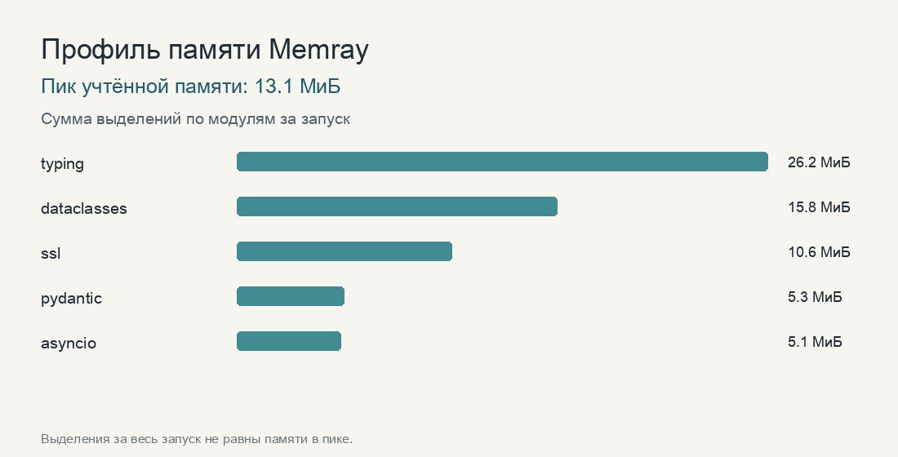

# Домашнее задание 2

## Правило и реализация

`needs_human` применяет восемь условий регламента. Порог нового возврата —
строго больше 5 000 рублей, порог повторного списания — строго больше 15 000.
В `Draft` нет поля `needs_human`; оно вычисляется при сборке `Ticket`. Цитата и
номера платежей проходят те же проверки, что в `Ticket`. Дополнительно `Draft`
проверяет порядок номеров и отсутствие повторов. Пакетный разбор сохраняет
порядок ответов и возвращает исключение на месте сбойного обращения.

## Расхождения на `dev`

В качестве исходной версии взят разбор `desk.triage`, где поле `needs_human`
заполняет модель. На всех 60 обращениях `dev` он разобрал 60/60, правильно
определил категорию в 56/60, передачу человеку в 57/60, срочность с допуском
в один балл в 52/60. Расход составил 398 взвешенных токенов на обращение.
Итоговая версия правильно разобрала все 60 обращений по всем четырём долям.

В тройках ниже указаны категория, срочность и передача человеку. «Совпало»
означает совпадение всех трёх полей с эталоном. Причина указывает на границу,
по которой исходная версия ошиблась; отдельный ответ модели может меняться
между прогонами.

| ID | Эталон | До правки | После правки | Причина |
|---|---|---|---|---|
| T-010 | платежи, 2, нет | платежи, 4, нет | совпало | Модель: не учла успешный повтор оплаты. |
| T-011 | платежи, 4, нет | платежи, 4, да | совпало | Постановка: возврат перевода по СБП принят за возврат сервиса. |
| T-017 | тарифы, 1, нет | платежи, 2, нет | совпало | Постановка: комиссия за перевод имеет приоритет над темой перевода. |
| T-023 | платежи, 2, нет | платежи, 4, да | совпало | Модель: резерв средств принят за новый возврат. |
| T-025 | платежи, 1, нет | другое, 1, нет | совпало | Постановка: вопрос о способе оплаты не был выделен. |
| T-028 | возвраты, 2, да | возвраты, 4, да | совпало | Пример: просьба оформить возврат без просрочки имеет срочность 2. |
| T-031 | возвраты, 2, нет | возвраты, 2, да | совпало | Постановка: отказ продавца не означает новый возврат через сервис. |
| T-038 | возвраты, 2, нет | возвраты, 4, нет | совпало | Пример: сумма нового возврата сама по себе не повышает срочность. |
| T-067 | тарифы, 2, нет | платежи, 4, нет | совпало | Постановка: возвращённый вывод без просрочки относится к тарифам, срочность 2. |
| T-074 | интеграция, 5, да | интеграция, 3, да | совпало | Постановка: отказ всех запросов создания платежа означает полный простой. |
| T-085 | другое, 2, да | доступ, 5, да | совпало | Разметка: подозрительное письмо без списания имеет срочность 2, но требует человека. |
| T-088 | другое, 3, нет | другое, 1, нет | совпало | Постановка: сообщение без деталей «всё сломалось» получает срочность 3. |

## Правки и доли

Первый вариант `Draft` и `needs_human` устранил три ошибки передачи человеку:
57/60 стало 60/60. Категория выросла с 56/60 до 57/60, срочность с допуском
в балл с 52/60 до 56/60. Обе версии разобрали 60/60 обращений. Расход
вырос с 398 до 528 взвешенных токенов на обращение.

| Версия | Разобрано | Категория | Человек | Срочность до балла | Взвешенных на обращение |
|---|---:|---:|---:|---:|---:|
| Исходная | 1,000 | 0,933 | 0,950 | 0,867 | 398 |
| Перенос решения в код | 1,000 | 0,950 | 1,000 | 0,933 | 528 |
| Уточнение границ | 1,000 | 1,000 | 0,983 | 0,983 | 551 |
| Незатребованный код | 1,000 | 1,000 | 0,983 | 1,000 | 576 |
| Уточнение фишинга | 1,000 | 1,000 | 1,000 | 1,000 | 617 |

Постановка различает возврат покупки и ошибочный перевод, отказ продавца и
просьбу оформить возврат через сервис, тестовый и боевой ключ. Три примера не
совпадают с обращениями набора. После первого замера дополнительно уточнены
комиссия за перевод, способы оплаты, ошибочный перевод, возвращённый вывод,
полный отказ API и подозрительное письмо. Итог этого уточнения измеряется
повторным прогоном `dev`: категория стала верной во всех 60 случаях, а
срочность в 59. После правила о незатребованном коде срочность стала верной
в 60/60, но признак фишинга для подозрительного письма сработал нестабильно.
Постановка теперь прямо связывает письмо от имени сервиса с просьбой выдать
данные карты и `fraud=true`. После этого совпали 60/60 решений о передаче
человеку; все остальные доли также равны 60/60. Рост расхода от исходной
версии составляет 219 взвешенных токенов на обращение.

Локальная проверка без шлюза: `101` тест прошёл; отдельно проверены оба
граничных значения и все шесть логических признаков передачи человеку.

```bash
LLM_CACHE_DIR= uv run python -m desk.escalation --split dev
uv run pytest tests
uv run ty check
```

## Итоговый `test`

Первый запуск `test` после настройки по `dev`: 30/30 разобрано, категория
30/30, передача человеку 29/30, срочность с допуском в балл 29/30;
539 взвешенных токенов на обращение. В `T-078` модель не связала остановку
продаж после отказа ключа с полным отказом приёма платежей. Она поставила
срочность 3 и не передала обращение человеку вместо эталонных 5 и «да».

После просмотра этой ошибки постановка уточнена: остановка продаж из-за
неработающего ключа или API означает полный отказ приёма платежей; отдельный
неудачный платёж и частичный приём таким отказом не считаются. В повторной
диагностике `T-061` сохранил срочность 2 и ответ «без человека», `T-074`
и `T-078` получили срочность 5 и передачу человеку. Повторный прогон всех
30 обращений `test` дал 30/30 по разбору, категории, передаче человеку и
срочности с допуском в балл; расход составил 571 взвешенный токен на
обращение. Этот повтор уже не является независимым итоговым замером:
постановка уточнена после просмотра `T-078`.

## Память и пределы

Memray записал трассу прогона пяти обращений `dev`; все пять прошли проверку.
Пик учтённой памяти составил 13 753 289 байт, или 13,1 МиБ. PNG построен
из сводки Memray; длина полос показывает сумму выделений за запуск, а число
вверху — память в пике.



В отдельной проверке 1000 запросов к подставному шлюзу после сборки мусора
удерживалось 65 216 байт после 500 запросов и 70 066 после 1000: разница
4 850 байт. Журнал клиента содержал 128 записей. Эта короткая проверка не
доказывает отсутствие роста при длительной нагрузке; в коде ограничены размер
ответа и потока (по 1 МБ), блок чтения (64 КБ), число задач в пачке и число
повторов запроса. Для запросов задан предел времени.

```bash
LLM_CACHE_DIR= uv run memray run -f -o runs/escalation.bin -m desk.escalation --split dev --n 5
uv run memray stats --json -f -o runs/escalation.json runs/escalation.bin
uv run memray flamegraph -f --no-web -o runs/escalation.html runs/escalation.bin
uv run python tools/memory_chart.py runs/escalation.json assets/memory.png
uv run python -m tools.leak_probe
```
